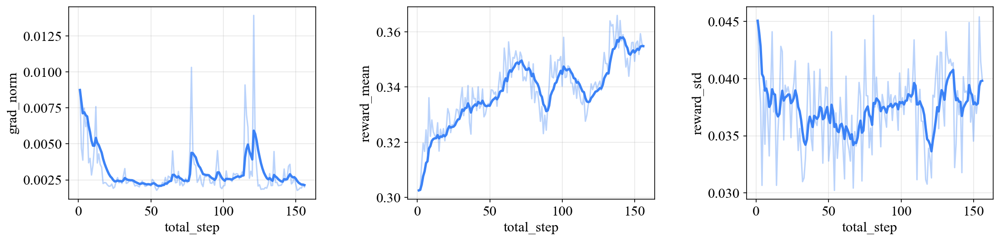

<p align="center">
    <br>
    
    <br>
<p>

<p align="center">
  <a href="https://github.com/junkunyuan/NexusAlign/blob/main/LICENSE"></a>
  <a href="https://www.python.org/downloads/"></a>
  <a href="https://pytorch.org/"></a>
</p>

---

NexusAlign is a unified and extensible framework for aligning foundation models.

- [✨ Features](#-features)
- [📦 Installation](#-installation)
- [🎯 Get Started](#-get-started)
  - [⚙️ Config Options](#️-config-options)
  - [🚀 Training](#-training)
  - [⚖️ Evaluation](#️-evaluation)
- [🛠️ Utilities](#️-utilities)
  - [⬇️ Download Models/Datasets](#️-download-modelsdatasets)
  - [📈 Plot Results](#-plot-results)
- [📚 Citation](#-citation)

## ✨ Features

- **Alignment Algorithms**: GRPO and DPO.
- **Foundation Models**: Z-Image, Qwen-Image, FLUX, and SD3.
- **Reward Models**: various VLMs, HPS v2, ImageReward, CLIP Score, and more.

## 📦 Installation

**Requirements**: Python ≥3.10, PyTorch ≥2.5, and CUDA.

```bash
git clone https://github.com/junkunyuan/NexusAlign.git
cd NexusAlign
pip install -e .
```

## 🎯 Get Started

### ⚙️ Config Options

Both training and evaluation share the same configuration injection mechanism.

Config options:
- ⌨️ CLI overrides: append `arg_key=arg_value`.
- 📄 Config file: `--config` / `-c` with a YAML file path.

💡 *Priority: CLI overrides > Custom config file (`-c`) > Default configs.*

To avoid downloading datasets and models on-the-fly, you can [pre-download them locally](#️-download-modelsdatasets) and load them by setting `common.data_and_model_dir`.

### 🚀 Training

We provide a unified command `nexus-align train` to run training.

Example usage (single-node, 4 GPUs):

```bash
nexus-align train \
  --nproc_per_node=4 \
  model=flux \
  log.exp_info=train-exp-flux \
  common.data_and_model_dir=${MY_DATA_AND_MODEL_DIR}
```

Example usage (multi-node, 2 nodes, 8 GPUs per node, run it on each node):

```bash
nexus-align train \
  --nnodes=2 \
  --nproc_per_node=8 \
  --node_rank=${NODE_RANK} \
  --master_addr=${MASTER_ADDR} \
  --master_port=${MASTER_PORT} \
  -c ${MY_TRAIN_CONFIG_YAML}
```

### ⚖️ Evaluation

We provide a unified command `nexus-align eval` to run evaluation.

**Use a trained checkpoint:** set `model.eval.ckpt_path` (e.g. `<checkpoints/model.pt>`).

Example usage (single-node, 4 GPUs):
```bash
nexus-align eval \
  --nproc_per_node=4 \
  model=flux \
  data=hpd_v2_benchmark \
  reward_model=hps_v2 \
  log.exp_info="eval-exp-flux" \
  common.data_and_model_dir=${MY_DATA_AND_MODEL_DIR} \
  model.eval.ckpt_path=${MY_MODEL_CKPT_PATH}
```

Example usage (multi-node, 2 nodes, 8 GPUs per node, run it on each node):
```bash
nexus-align eval \
  --nnodes=2 \
  --nproc_per_node=8 \
  --node_rank=${NODE_RANK} \
  --master_addr=${MASTER_ADDR} \
  --master_port=${MASTER_PORT} \
  -c ${MY_EVAL_CONFIG_YAML}
```

## 🛠️ Utilities

### ⬇️ Download Models/Datasets

Following HuggingFace, we design the file structure of models/datasets as follows:

```bash
${MY_DATA_AND_MODEL_DIR}
    ├── Qwen/Qwen3.5-27B
    ├── black-forest-labs/FLUX.1-dev/
    ├── zai-org/ImageReward/
    ├── ymhao/HPDv2/
    └── ...
```

We provide a script to download pre-defined models/datasets used for training/evaluation.

Example usage:
```bash
nexus-align download \
  --repo_id "black-forest-labs/FLUX.1-dev" \
  --cache_dir ${MY_DATA_AND_MODEL_DIR}
```

After downloading, simply set `common.data_and_model_dir` to `${MY_DATA_AND_MODEL_DIR}` for training or evaluation, then the models/datasets will be loaded from local instead of downloading on-the-fly.

### 📈 Plot Results

We provide a script to plot results from training logs.

Example usage:
```bash
nexus-align draw --result logs/my_exp/results.jsonl
```

After drawing, a plot will be saved to `<logs/my_exp/results.png>` looks like:
<p align="center">
    <br>
    
    <br>
<p>

## 📚 Citation

```bibtex
@misc{nexus-align-2026,
  title = {NexusAlign: A Unified and Extensible Framework for Aligning Foundation Models},
  author = {Junkun Yuan, You Huang, Zijing Hu, Mingxuan Cui},
  year = {2026},
  url = {https://github.com/junkunyuan/NexusAlign}
}
```

```bibtex
@article{rl-in-multimodal-survey,
  title={Reinforcement Learning in Generative Multimodal AI: A Survey},
  author={Hu, Zijing and Yuan, Junkun and Han, Kairong and Tong, Yunze and Zhang, Shengyu and Wu, Fei and Kuang, Kun},
  year={2026},
  publisher={TechRxiv}
}
```
